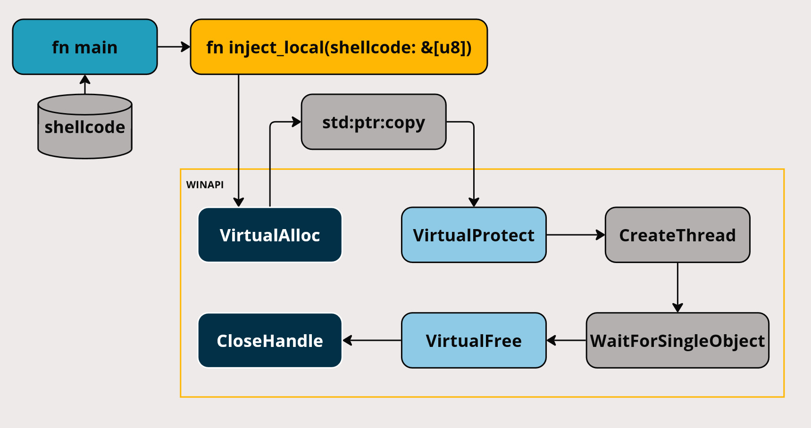

# shellcode_local_inject
- This code compiles to an exe which executes some shellcode on the windows OS

- First the `VirtualAlloc` WINAPI is called to allocate some memory in the current process.
- Then the embedded shellcode is then copied over to the allocated memory using `std:ptr:copy`
- The memory protection parameters of the allocated memory space are changed from RW to RX using `VirtualProtect`
- A thread is created referencing the allocated memory using `CreateThread`
- `WaitForSingleObject` is used to wait for our thread to exit to prevent program from closing before the shellcode ends
- since we are doing unsafe WinAPI stuff we have to clean up after ourselves using `VirtualFree` & `CloseHandle`